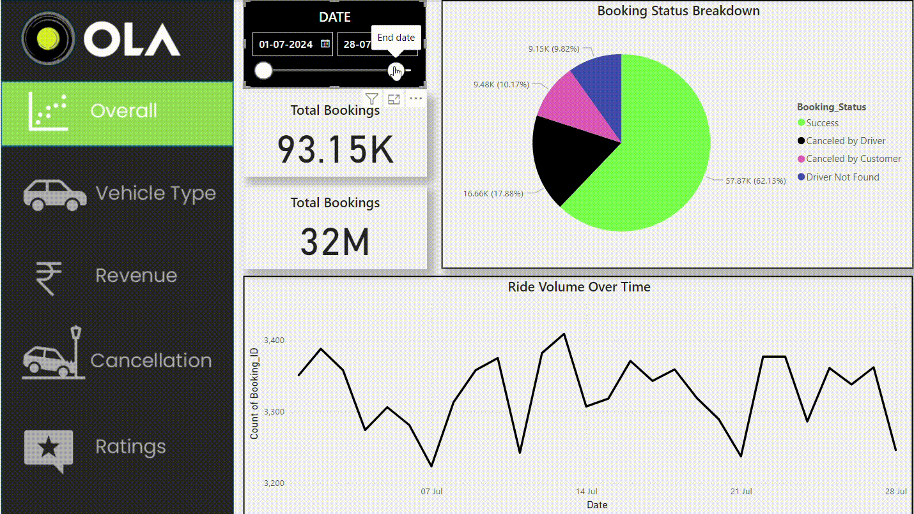
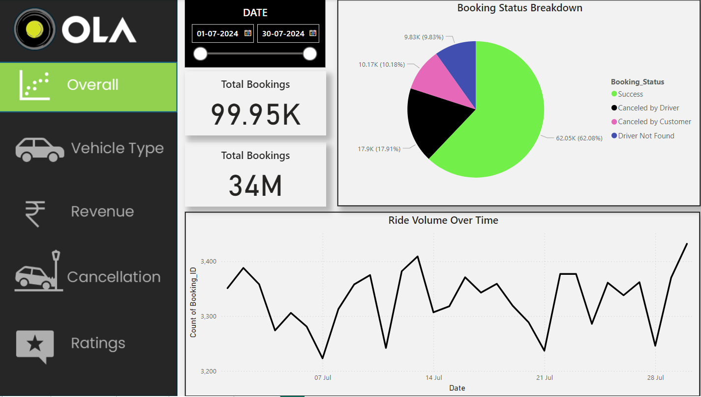
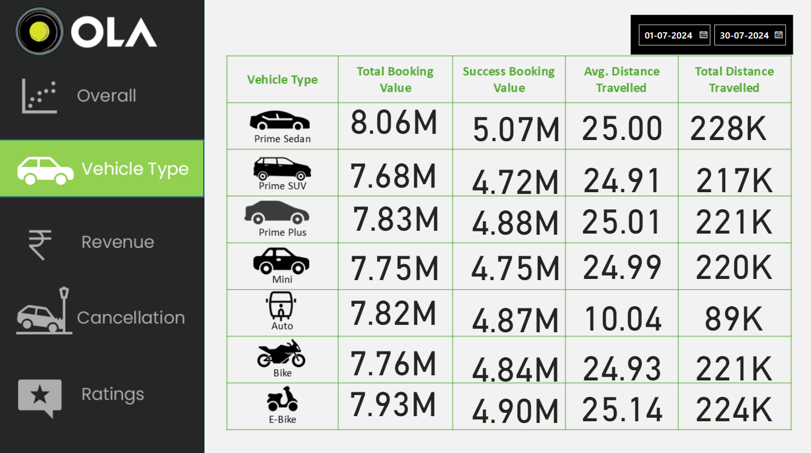
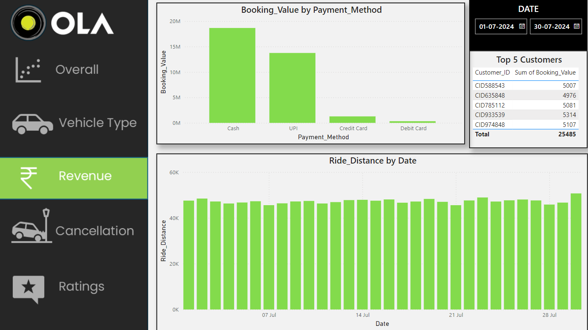
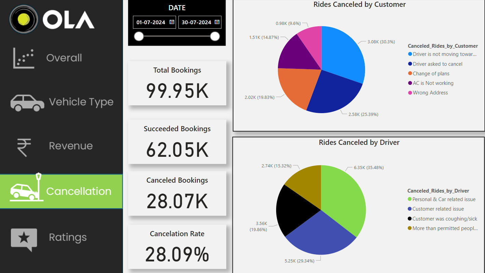
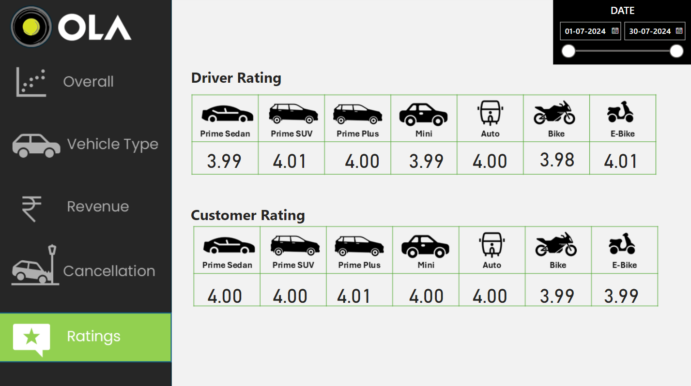



# 🚖 OLA Business Intelligence & Operational Analytics Dashboard

### Executive Business Intelligence Solution using SQL, MySQL & Power BI

Transforming ride-booking data into actionable business intelligence through interactive dashboards, KPI reporting, and operational analytics.

---

---

# 🎥 Dashboard Preview

---

# 📋 Executive Summary

This project delivers an executive Business Intelligence solution for a ride-hailing platform by combining SQL, MySQL, and Power BI.

The dashboard consolidates operational ride-booking data into interactive reports that enable stakeholders to monitor business performance, analyze customer behavior, evaluate revenue trends, and identify operational improvement opportunities.

---

# 💼 Business Problem

Ride-hailing companies generate thousands of bookings every day across multiple vehicle categories.

Without centralized reporting, business teams struggle to answer questions such as:

- Which services generate the highest revenue?
- Why are rides being cancelled?
- Which customers contribute the most revenue?
- How satisfied are customers?
- Which operational KPIs require immediate attention?

---

# 🎯 Business Objectives

- Monitor operational KPIs
- Analyze booking trends
- Evaluate customer experience
- Track revenue performance
- Identify cancellation patterns
- Support data-driven decision making

---

# 🔄 Business Intelligence Workflow

---

# 🛠 Technology Stack

| Category | Technologies |
|----------|--------------|
| Database | MySQL |
| Query Language | SQL |
| BI Tool | Power BI |
| Data Modeling | Power Query |
| Measures | DAX |
| Data Source | CSV |
| Version Control | Git & GitHub |

---

# 📊 Dashboard Modules

## Executive Overview

---

## Vehicle Performance

---

## Revenue Analysis

---

## Cancellation Analysis

---

## Customer & Driver Ratings

---

# 🔍 Business Questions Solved

- Which vehicle types generate the highest revenue?
- What is the booking completion rate?
- Which payment methods are most frequently used?
- Who are the highest-value customers?
- What are the primary cancellation reasons?
- How do customer and driver ratings compare?

> Complete SQL implementation is available in the **sql/** directory.

---

# 📈 Executive Findings

### Revenue

- Successfully completed rides generate the majority of revenue.
- Digital payment methods account for the highest transaction volume.

### Operations

- Booking completion rates indicate strong operational efficiency.
- Cancellation trends reveal opportunities for improving service quality.

### Customer Experience

- Customer satisfaction remains consistently positive.
- Highly rated drivers achieve better ride completion performance.

### Fleet Performance

- Premium vehicle categories contribute higher booking value.
- Ride demand varies significantly across vehicle segments.

---

# 💡 Strategic Recommendations

### Short-Term

- Reduce pickup waiting time.
- Improve driver allocation during peak demand.
- Enhance customer communication.

### Medium-Term

- Optimize fleet distribution.
- Introduce driver incentive programs.
- Improve cancellation monitoring.

### Long-Term

- Predict cancellations using machine learning.
- Implement demand forecasting.
- Develop customer segmentation strategies.

---

# 📊 Business Value Delivered

This solution enables organizations to:

- Centralize operational reporting
- Improve KPI visibility
- Reduce manual reporting effort
- Enhance executive decision-making
- Monitor customer satisfaction
- Track revenue performance
- Identify operational bottlenecks

---

# 🎯 Skills Demonstrated

### Business Intelligence

- KPI Development
- Dashboard Design
- Executive Reporting
- Data Visualization

### Analytics

- Exploratory Data Analysis
- Revenue Analysis
- Operational Analytics
- Customer Analytics

### Technical

- SQL
- MySQL
- Power BI
- Power Query
- DAX

---

# 🚀 Future Roadmap

- SQL Server Integration
- Power BI Service Deployment
- Row-Level Security
- Incremental Refresh
- Predictive Analytics
- Real-Time Dashboard

---

# 📌 Why This Project Matters

Organizations generate large volumes of operational data every day, but data creates value only when it supports informed business decisions.

This project demonstrates how SQL and Power BI can transform operational data into executive-ready dashboards that improve reporting efficiency, increase KPI visibility, and support evidence-based decision-making.

---

# 📚 Additional Documentation

Detailed technical implementation is available in the following documents:

- 📄 [SQL Analysis](docs/SQL_Queries.md)
- 📄 [DAX Measures](docs/DAX_Measures.md)
- 📄 [Data Model](docs/Data_Model.md)

---
