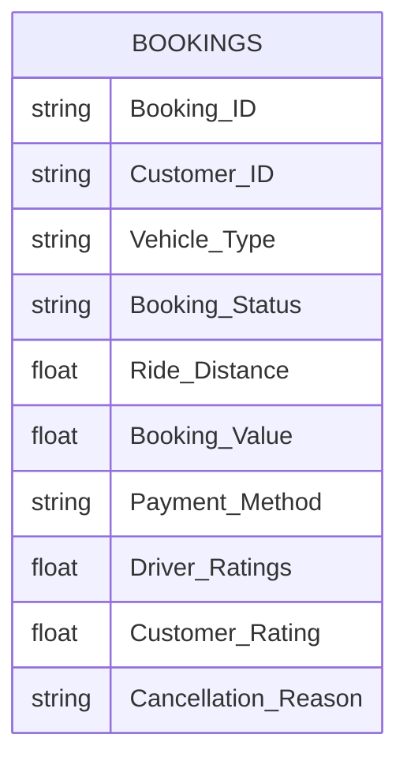

# Data Model

## Overview

The OLA Business Intelligence & Operational Analytics Dashboard is built using a single operational dataset that captures ride booking transactions. The data model is intentionally lightweight, making it suitable for analytical reporting while ensuring fast dashboard performance.

---

# Data Model Architecture

---

# Source Dataset

The solution uses a single transactional dataset containing ride-booking records.

| Source | Description |
|---------|-------------|
| Bookings.csv | Ride booking transaction data |

---

# Fact Table

## Bookings

The **Bookings** table acts as the central fact table and stores every ride transaction.

### Primary Fields

| Column | Description |
|----------|-------------|
| Booking_ID | Unique booking identifier |
| Customer_ID | Customer identifier |
| Vehicle_Type | Vehicle category |
| Booking_Status | Ride status |
| Ride_Distance | Distance travelled |
| Booking_Value | Ride revenue |
| Payment_Method | Payment mode |
| Driver_Ratings | Rating provided to driver |
| Customer_Rating | Rating provided by customer |
| Cancellation_Reason | Cancellation reason |

---

# Data Preparation

Data transformation was performed in **Power Query** before loading the dataset into the report.

The following preprocessing steps were applied:

- Verified column data types
- Removed duplicate records
- Checked missing values
- Standardized booking status values
- Validated payment methods
- Ensured numerical consistency
- Prepared data for DAX calculations

---

# Data Model Design

The dashboard uses a **single-table analytical model**.

This approach was selected because:

- Dataset originates from a single transactional source.
- No lookup tables were required.
- Simplifies maintenance.
- Improves report performance.
- Reduces model complexity.

---

# Data Relationships

Since the project uses one centralized fact table, no table relationships are required.

---

# DAX Layer

Business KPIs are calculated using DAX measures instead of calculated columns wherever possible.

Examples include:

- Total Bookings
- Successful Rides
- Total Revenue
- Average Booking Value
- Average Driver Rating
- Average Customer Rating

This approach minimizes memory usage while improving report maintainability.

---

# Reporting Layer

The Power BI dashboard is organized into five analytical modules.

| Dashboard | Purpose |
|------------|----------|
| Executive Overview | Overall business performance |
| Vehicle Performance | Vehicle utilization analysis |
| Revenue Analysis | Revenue and payment insights |
| Cancellation Analysis | Operational bottlenecks |
| Ratings Analysis | Customer and driver satisfaction |

---

# Design Considerations

The data model follows Business Intelligence best practices:

- Single source of truth
- Centralized fact table
- Lightweight model
- DAX-based calculations
- Interactive reporting
- Executive-focused KPIs

---

# Future Enhancements

As the solution scales, the model can evolve into a dimensional (Star Schema) model.

Potential dimension tables include:

- Dim Customer
- Dim Driver
- Dim Vehicle
- Dim Payment Method
- Dim Date

This would support larger datasets and enterprise-scale reporting.